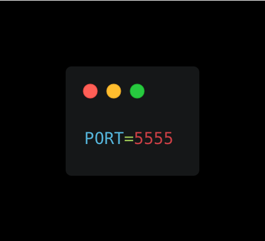
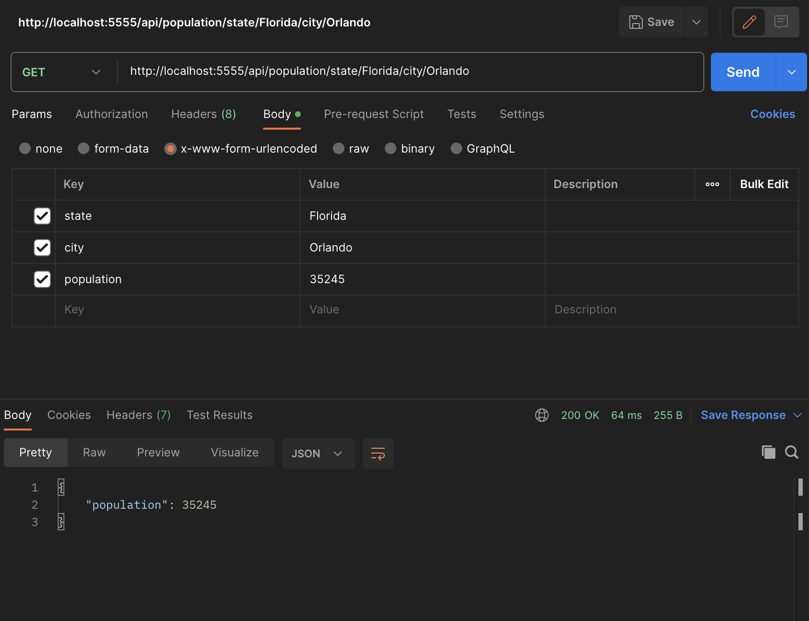
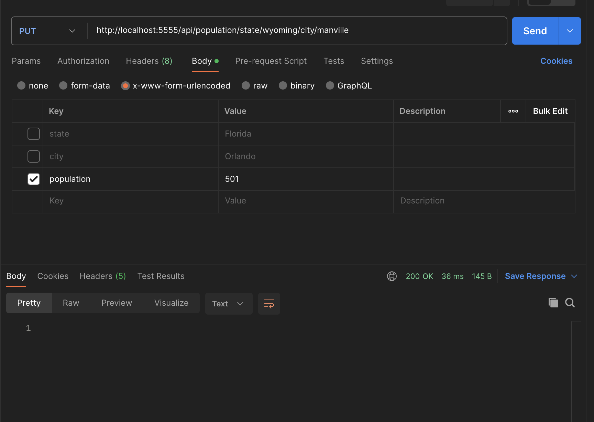
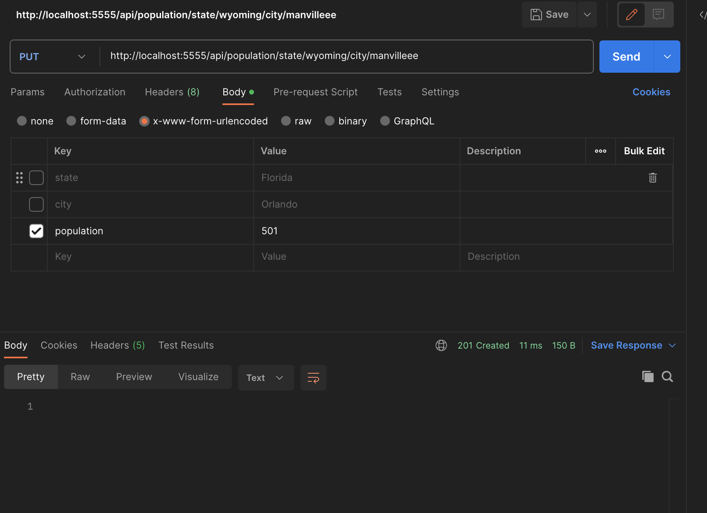
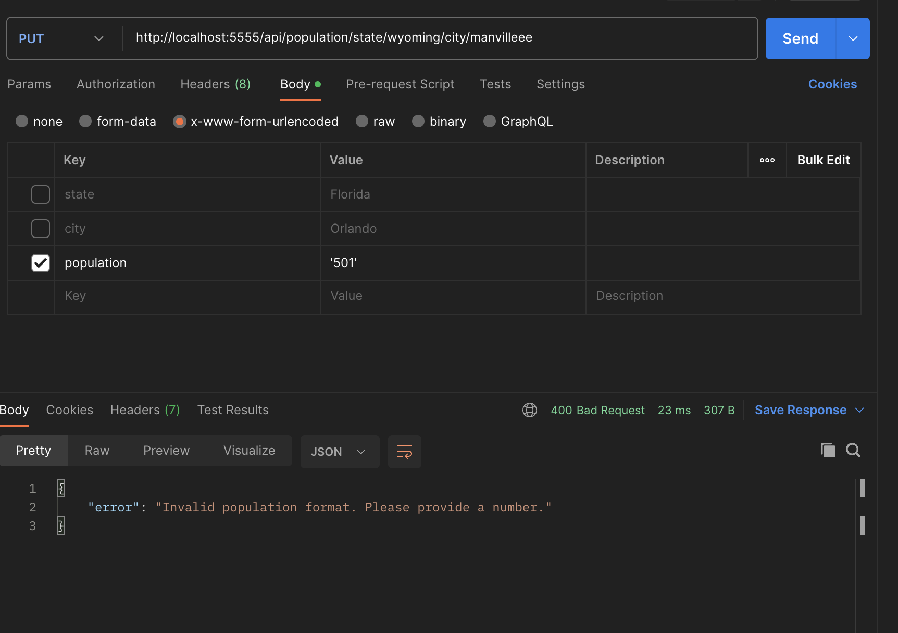

HOW TO USE:
 
 
* RUN npm install
* Make a .env file to store the PORT number 5555, See below for visuals.

* Run npm start and start hitting the endpoints (I used postman for testing the routes). See below for visuals

 
 

